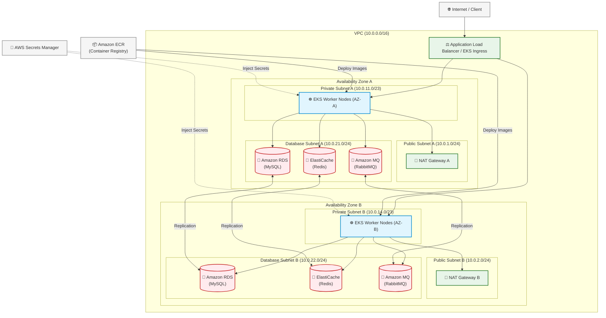

# AWS Deployment Architecture - Stan's Robot Shop

This document describes the AWS Cloud Architecture for deploying **Stan's Robot Shop** in a highly available, secure, and multi-AZ environment.

## Architecture Overview

The application is deployed on **Amazon EKS (Elastic Kubernetes Service)** across two Availability Zones (AZs) in the **Asia Pacific (Mumbai) `ap-south-1`** region. The network is isolated using a custom **VPC** with public and private subnets.

 
*(Note: Upload your architecture image to the repository root as `aws-architecture.png` to render it here.)*

---

## Component Architecture Diagram (Mermaid)

---

## Key Infrastructure Details

### 1. Network Subnetting (VPC: `10.0.0.0/16`)
* **Public Subnets (`10.0.1.0/24` and `10.0.2.0/24`)**: Host NAT Gateways to route outbound internet traffic from private subnets (e.g., pulling external dependencies or communicating with outside APIs).
* **Private App Subnets (`10.0.11.0/23` and `10.0.14.0/23`)**: Run EKS worker node groups in a secure zone. No direct public internet ingress is allowed; all external traffic must pass through the Load Balancer.
* **Private Database Subnets (`10.0.21.0/24` and `10.0.22.0/24`)**: Houses databases and queues. Only accessible from the Private App subnets.

### 2. Computing (Amazon EKS & Amazon ECR)
* **Amazon EKS**: The orchestration engine for running all application microservices (Web, Cart, Catalogue, User, Payment, Shipping, Ratings, and Dispatch).
* **Amazon ECR**: Serves as the private container registry, storing built Docker images for deployment on the EKS cluster.

### 3. Managed Services mapping for Stan's Robot Shop
* **Database (MySQL)** -> **Amazon RDS (Multi-AZ MySQL)**: Used by the *Shipping* and *Ratings* services.
* **Cache (Redis)** -> **Amazon ElastiCache (Redis)**: Used by the *Cart* and *User* services.
* **Message Broker (RabbitMQ)** -> **Amazon MQ (RabbitMQ)**: Used by *Payment* and *Dispatch* services.
* **Secrets Management** -> **AWS Secrets Manager**: Securely stores database passwords, API credentials, and Instana agent keys, injecting them dynamically into the EKS pods.
